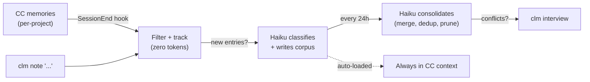

<p align="center">
  
</p>

<h1 align="center">claude-me</h1>

<p align="center">
  Cross-project persona wiki for <a href="https://docs.anthropic.com/en/docs/claude-code">Claude Code</a>.<br/>
  Learns how you work — not what you build.
</p>

---

Claude Code's memory is project-scoped. You correct it in one project, but the next one doesn't know. **claude-me** extracts cross-project preferences from your existing CC memories into a single, portable corpus.

## How It Works



Two input paths: CC memories are extracted automatically via SessionEnd hook; `clm note` lets you add preferences directly. Both are filtered with source tracking (free) — Haiku is only called when there's genuinely new material. The corpus index is auto-loaded into every CC session via `@include`.

## Install

```bash
git clone https://github.com/RyanNg1403/claude-me.git
cd claude-me
npm install && npm run build && npm link
clm install
```

Requires: `node >=18`, `jq`, `claude` CLI

## Usage

### As a Claude Code skill

| Command | Description |
|---------|-------------|
| `/claude-me` | Load your preferences into context |
| `/claude-me sync` | Extract from all active projects now |
| `/claude-me consolidate` | Merge and deduplicate the corpus |
| `/claude-me consolidate "..."` | Consolidate with specific focus |
| `/claude-me costs` | Show accumulated API costs |
| `/claude-me status` | Corpus stats and system health |
| `/claude-me note "..."` | Add a preference note |
| `/claude-me interview` | Answer pending preference questions |

### As a CLI

| Command | Description |
|---------|-------------|
| `clm sync` | Extract from all active projects |
| `clm consolidate` | Merge and deduplicate |
| `clm consolidate "..."` | Consolidate with specific focus |
| `clm costs` | Show API cost breakdown |
| `clm status` | Corpus stats and system health |
| `clm note "..."` | Add a preference note |
| `clm note "..." --now` | Add + process immediately |
| `clm note "..." --now --detach` | Add + process in background |
| `clm interview` | Answer pending preference questions |
| `clm install` | Set up hook + symlink + corpus |
| `clm uninstall` | Remove hook + symlink |

After installation, extraction runs **automatically** on every session end. No manual effort needed.

## Cost

| Scenario | Cost |
|----------|------|
| No new memories (most sessions) | **$0.00** |
| Per session (~3 candidates) | ~$0.002 |
| Daily consolidation | ~$0.003 |
| Monthly (10 sessions/day) | ~$0.69 |

All LLM calls use Haiku ($0.80/M input, $4.00/M output).

## Corpus

Stored at `~/.claude/claude-me/corpus/` — private, outside the repo:

```
interaction-style/   How you communicate with Claude Code
rules/               Corrections you enforce everywhere
patterns/            Workflow habits and tool preferences
projects/            High-level view of what you're building
```

Each entry uses the same markdown + frontmatter format as CC memories.

## Configuration

Edit `config.json`:

| Setting | Default | Description |
|---------|---------|-------------|
| `consolidation_interval_hours` | `24` | Hours between auto-consolidation |
| `project_freshness_days` | `14` | Skip inactive projects |
| `excluded_projects` | `[]` | Project slugs to ignore |
| `debug` | `false` | Verbose logging |

## Uninstall

```bash
clm uninstall          # confirmation prompt, then removes everything
clm uninstall --yes    # skip confirmation
```

## License

MIT
