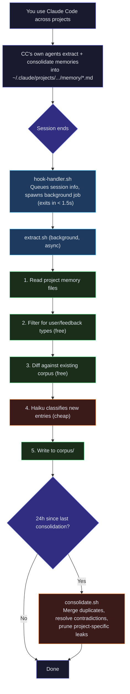

# claude-me

> A cross-project persona wiki for [Claude Code](https://docs.anthropic.com/en/docs/claude-code). Learns how you work — not what you build.

Claude Code's memory is project-scoped. You correct it in one project ("don't commit without asking"), but the next project doesn't know. **me-agent** fixes this by extracting cross-project preferences from your existing Claude Code memories into a single, portable corpus.

## How It Works



> **Key insight:** We never mine raw transcripts. Claude Code already spent the tokens to extract and consolidate project memories. We read those pre-refined `.md` files, filter with grep (zero tokens), and only call Haiku on the small filtered set.

## Cost

| Scenario | Input | Output | Cost |
|----------|-------|--------|------|
| **Bootstrap** (first run, all projects) | ~18K tokens | ~4K tokens | **~$0.03** |
| **Per session** (steady state) | ~1K tokens | ~400 tokens | **~$0.002** |
| **Consolidation** (daily) | ~1.6K tokens | ~500 tokens | **~$0.003** |
| **Monthly** (10 sessions/day) | — | — | **~$0.69** |

All calls use Haiku ($0.80/M input, $4.00/M output). Most work is done by bash scripts at zero token cost.

## Install

```bash
git clone https://github.com/user/me-agent.git
cd me-agent
bash install.sh
```

This will:
1. Symlink the skill to `~/.claude/skills/me-agent/`
2. Create `~/.claude/me-agent/` for your personal data (corpus, logs)
3. Register a `SessionEnd` hook in `~/.claude/settings.json`

Your preferences are stored at `~/.claude/me-agent/corpus/`, separate from the repo — never committed to git.

**Requires:** `jq`, `claude` CLI

## Usage

| Command | What it does |
|---------|--------------|
| `/me-agent` | Load your preference corpus into context |
| `/me-agent sync` | Extract from all active projects now |
| `/me-agent consolidate` | Merge, deduplicate, prune the corpus |

After installation, extraction runs **automatically** when each Claude Code session ends. The corpus grows over time with no manual effort.

## Corpus

Stored at `~/.claude/me-agent/corpus/` (private, outside the repo):

```
~/.claude/me-agent/corpus/
  ME.md                      ← top-level index (always loaded first)
  interaction-style/          ← how you talk to Claude Code
  rules/                     ← corrections you enforce everywhere
  patterns/                  ← workflow habits, tool preferences
  projects/                  ← high-level view of what you're building
```

Each subfolder has its own `ME.md` index + topic files. Topic files use the same format as Claude Code memories:

```yaml
---
name: Never commit without verification
description: Always ask user to verify changes work before committing
---

Never commit code without first asking the user to verify the change works.

**Why:** Committing untested changes wastes time if they need to be reverted.

**How to apply:** After making a change, ask to verify before committing.
```

## Configuration

Edit `config.json`:

| Setting | Default | Description |
|---------|---------|-------------|
| `consolidation_interval_hours` | `24` | Hours between consolidation runs |
| `extraction_model` | `haiku` | Model for extraction calls |
| `consolidation_model` | `haiku` | Model for consolidation calls |
| `project_freshness_days` | `14` | Skip projects with no activity in N days |
| `excluded_projects` | `[]` | Project slugs to ignore |
| `debug` | `false` | Verbose logging to stderr |

## Uninstall

```bash
bash uninstall.sh          # remove hook + symlink, keep data at ~/.claude/me-agent/
bash uninstall.sh --purge  # also delete ~/.claude/me-agent/ (corpus + logs)
```

## Design Principles

- **Claude Code native** — same markdown + frontmatter format, same progressive disclosure
- **Project-agnostic** — only patterns that generalize across projects
- **Token efficient** — piggyback on CC's extraction, grep before LLM, Haiku for everything
- **Transparent** — plain markdown files you can read, edit, and version control

## License

MIT
