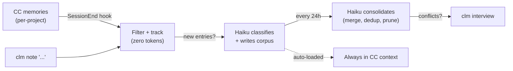

<p align="center">
  
</p>

<h1 align="center">claude-me</h1>

<p align="center">
  Cross-project persona wiki for <a href="https://docs.anthropic.com/en/docs/claude-code">Claude Code</a>.<br/>
  Learns how you work — not what you build.
</p>

---

Claude Code's memory is project-scoped. You correct it in one project, but the next one doesn't know. **claude-me** extracts cross-project preferences from your existing CC memories into a single, portable corpus.

## How It Works



Two input paths: CC memories (automatic via SessionEnd hook) and `clm note` (manual). Source tracking filters for free — Haiku is only called for genuinely new material. The corpus index is auto-loaded into every CC session via `@include`.

## Install

```bash
git clone https://github.com/RyanNg1403/claude-me.git
cd claude-me
npm install && npm run build && npm link
clm install
```

Requires: `node >=18`, `jq`, `claude` CLI

## Quick Start

```bash
clm sync                                # extract from all active CC projects
clm note "prefer early returns"         # add a preference directly
clm consolidate                         # merge and deduplicate corpus
clm status                              # corpus stats and system health
clm open                                # open the corpus dir in VS Code
clm verify rules/never-commit.md        # confirm an entry is still true
clm delete rules/old-rule.md            # soft-delete (recoverable for 7 days)
clm daemon enable                       # opt-in: daily 9am notification of one entry
```

As a Claude Code skill: `/claude-me`, `/claude-me sync`, `/claude-me note "..."`, etc.

Full CLI reference: [docs/cli.md](docs/cli.md)

## Cost

| Scenario | Cost |
|----------|------|
| No new memories (most sessions) | **$0.00** |
| Per session (~3 candidates) | ~$0.002 |
| Monthly (10 sessions/day) | ~$0.69 |

All LLM calls use Haiku ($0.80/M input, $4.00/M output).

## Configuration

Edit `config.json`:

| Setting | Default | Description |
|---------|---------|-------------|
| `consolidation_interval_hours` | `24` | Hours between auto-consolidation |
| `project_freshness_days` | `14` | Skip inactive projects |
| `excluded_projects` | `[]` | Project slugs to ignore |
| `staleness_threshold_days` | `30` | When entries count as stale for `clm glance`-style picking |
| `trash_retention_days` | `7` | How long soft-deleted entries stay recoverable |
| `daemon_hour` / `daemon_minute` | `9` / `0` | Daily notification fire time |
| `debug` | `false` | Verbose logging |

## Uninstall

```bash
clm uninstall          # confirmation prompt, then removes everything
clm uninstall --yes    # skip confirmation
```

## License

MIT
